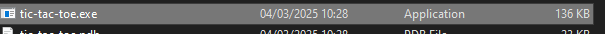
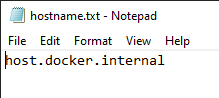
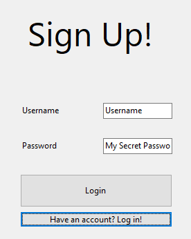

# Tic-tac-toe Online

## Get started

Install the executable, and open it by double-clicking it.

This will create a `hostname.txt` file, which you can edit with the URL of where the server is hosted, which the person who is hosting it should have told you.
If you don't want to play online, the default will work as well.

You can then reopen the app.

If you don't have an account on that server, you need to create one with a unique username, as well as a password.

If you already have an account, you can log in.

Afterwards, you can click the `Play against self / hotseat` button to play against yourself.
Otherwise, you can click on the name of any user that appears underneath it to message them, or to challenge them to a game of tic tac toe.
